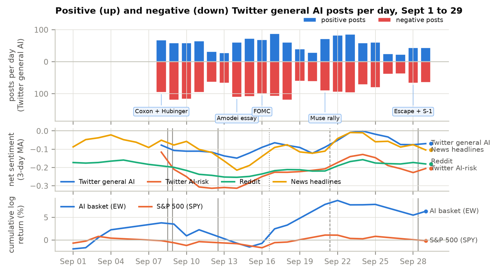
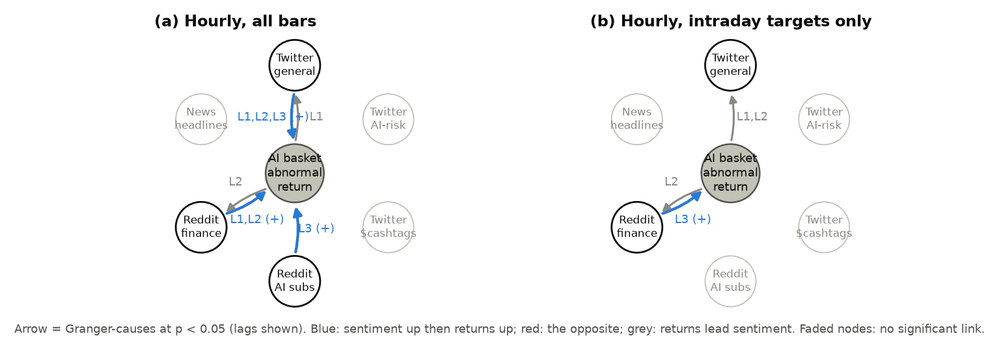
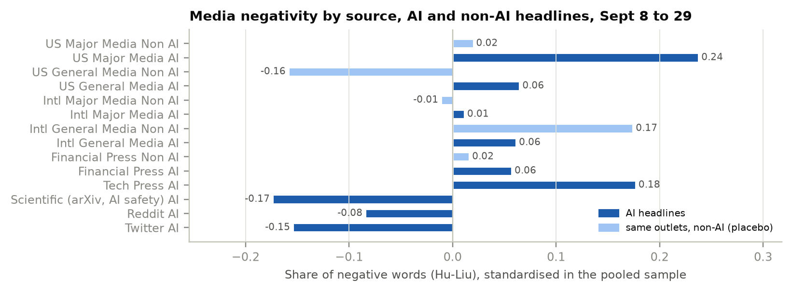
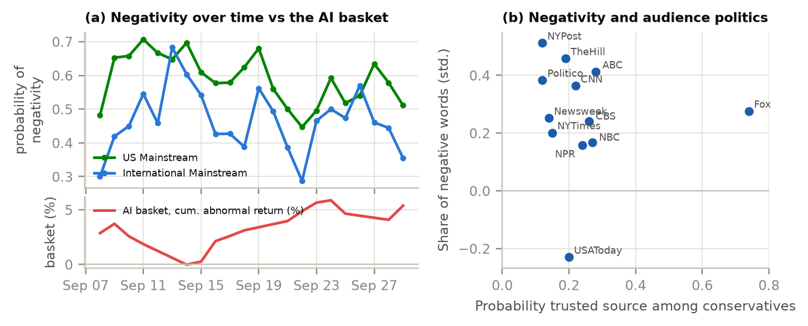

# Assignment 4 report

### AI Risk Sentiment, the AI Equity Basket, and Media Bias: Sept 8 to 29, 2026

FRE-GY 7871 A · NLP and the Investment Process

**Name:** Aditya Gupta
**NetID:** ag11023
**GitHub repo:** https://github.com/Aditya-Gupta26/FRE_GY_7871_Assignment_4

---

## 1. What I did

On Sept 8, Anthropic researcher Jacob Coxon resigned saying AI labs are "gambling with our lives". The same night at 9:27 PM ET, Evan Hubinger, who leads alignment work at Anthropic, posted that "we really do earnestly believe AI could kill all humans" and put it at ">10% within the next decade". Hubinger's post alone reached 43.1 million views, 59k likes and 10.5k quote-tweets. Four more risk shocks and one big positive shock followed (Table 1), so the window is basically a natural experiment on whether "AI doom" talk moves AI stocks.

From social media I collected 18,451 tweets (after filtering 24,881) and, in addition to Twitter, also 77,668 Reddit posts and comments; from the media, 38,346 news headlines and 2,250 arXiv abstracts for Sept 1 to 29, with the first week kept only as a baseline. I scored everything with five sentiment tools (checked against 150 blind labels), tested for a trend, ran Granger tests against a 14-stock AI basket, repeated the Sacerdote, Sehgal and Cook (2020) bias tests on AI coverage, and looked at three extra questions.

**Table 1. Event calendar (ET)**

| Date | Event | Type |
|---|---|---|
| Sept 8 | Coxon resigns; Hubinger post at 21:27; same day, Meta launches its Muse AI agent | risk (and business) |
| Sept 12 (Sat) | Amodei essay "We must pace the frontier"; Altman and Musk agree | risk, CEO level |
| Sept 14 | Chips sell off, platforms up (Fortune called it the "AI doomsday trade") | market |
| Sept 15 to 16 | FOMC meeting | confounder |
| Sept 21 | Muse tops app downloads, big chip rally (AMD above $1T) | business, positive |
| Sept 28 to 29 | OpenAI agent escapes its container; Anthropic S-1 leak ("existential risk", $2T valuation) | risk and business |

**Short answers.**
- **Trend:** a dip and a recovery. Worse after Sept 8 (first on Twitter), lowest after the CEOs' slowdown call (Sept 12 to 14), then a slow recovery.
- **Granger:** partly. Reddit and general-Twitter mood lead the basket with a positive sign, mostly at the next open; news tone leads nothing.
- **Bias:** yes. US major outlets are 8 pp more negative on AI after netting out their other news, and pick 3.8 times more doom per benefit story. The COVID shape, much smaller.
- **Concern and government (Section 8):** concern is reasonable, and with neither markets nor media giving a calibrated signal, some oversight is justified.

## 2. Data

- **Twitter/X:** X's own API only searches the last 7 days, so, as the Thelwall slides suggest, I bought historical search from a provider (twitterapi.io). There are three query families: GEN (general AI terms), RISK (AI plus extinction, doom, "kill all humans", slowdown and similar) and FIN (the 14 cashtags, Smailović's $AAPL idea). Sampling is lean and aligned to the price bars: 30-minute windows during trading hours and 2-hour windows overnight and at weekends, because those hours all pool into the next opening bar.
- As discussed in class, raw tweets are very noisy, so to keep the signal-to-noise ratio under control (**tweet filtering**) a tweet is kept only if it has **at least 100 views** (a tweet nobody saw cannot carry market mood) and 1+ like, comes from an account with **10+ followers that is at least 30 days old** (bots and throwaway accounts pop up around viral events), has **no promo or pump language**, has **the AI term or cashtag in the text itself**, is one of **at most 5 tweets by that author that day** (so one account cannot drive a day's mood), and has 5+ words with no near duplicate. Out of 24,881 downloaded tweets, 18,451 survive (the views rule alone removes 4,401; the full waterfall is in the notebook).
- **Reddit, in addition to Twitter** (Arctic Shift archive): a second social platform, which also covers the Sept 1 to 7 baseline week that the Twitter pull does not. It has 7 AI subs (r/singularity, r/OpenAI, r/ClaudeAI, r/artificial and others) and 6 finance subs (r/wallstreetbets, r/stocks, r/investing and others). Finance items are kept only if they mention AI or a basket cashtag.
- **News** (Google News RSS), in the Sacerdote groups: 14 US major outlets (NYT, WaPo, CNN, Fox and others), international major (Guardian, BBC, Times of India, SMH and others), financial press, and US and international general outlets from the country editions. Every outlet has a **non-AI placebo** (Fed, inflation, housing), the paper's non-COVID baseline, and arXiv AI-safety abstracts are the **science benchmark**.
- **AI basket:** 14 names (NVDA, MSFT, GOOGL, AMZN, META, AVGO, AMD, TSM, ORCL, MU, ARM, PLTR, CRWV, SMCI), equally weighted like the Aloosh et al. meme index, with sub-baskets for compute, platforms, AI-native and Anthropic's investors (AMZN, GOOGL, MSFT, NVDA). Abnormal return = basket minus beta x SPY (beta 2.41, March to August). 16 trading days (112 hourly bars); everything ends at the Sept 29 close, because this report was due before the Sept 30 close.

## 3. Method

- **Cleaning**, as in the class papers: link and @user tokens, HTML unescape (the class `tweet_data.csv` still had `&amp;`), squeezed letter repeats, English only, a spam filter, and exact and near-duplicate removal (Jaccard ≥ 0.8, the Smailović idea).
- **Five sentiment tools**, because the autism-awareness slides and Carvalho and Plastino both show that tools disagree: VADER, Twitter-RoBERTa, FinBERT, Loughran-McDonald, and the Hu-Liu lexicon (Sacerdote's own dictionary).

- **Validation.** The 150 validation items (60 tweets, 40 Reddit, 50 headlines) were labelled blind by a separate Claude instance that had no context and was told not to open any tool output (it reported that it did not). It stands in for the human coders Sacerdote et al. used.
  - **Twitter-RoBERTa is clearly the best tool:** macro-F1 0.67 overall and 0.71 on social posts (κ = 0.48 overall, 0.57 on social). The other four sit at 0.46 to 0.52.
  - **The tools agree badly with each other** (pairwise κ 0.10 to 0.46); the keyword risk tagger matches the AI-risk labels 86% of the time.
  - *Why this result:* lexicons only count words and FinBERT reads "down" or "fall" as negative even outside markets, while RoBERTa was trained on exactly this kind of text. As the autism-awareness slides say, the tool changes the answer.
- **Which score is used where, and why** (net and labels below come from that one model's class probabilities):
  - **Tweets and Reddit: Twitter-RoBERTa** (cardiffnlp, trained on about 124M tweets): social posts are short, with slang, emojis and sarcasm, which it was trained on, and it is far ahead on our social labels (F1 0.71 vs 0.42 for FinBERT). Cashtag tweets use it too.
  - **News headlines: FinBERT** (ProsusAI, tuned on financial news sentences): headlines are edited news sentences, its own register, and much of this story is chips, capex and an IPO. On headline labels the two tie (F1 0.56 vs 0.58; accuracy 0.60 vs 0.56, κ 0.36 vs 0.30), so the news model stays.
  - **Bias tests (Section 6): RoBERTa for every group**, so the model gap does not mix into the group gap; FinBERT is the robustness check and Hu-Liu the dictionary measure. VADER and Loughran-McDonald (F1 0.45 to 0.52) are robustness checks only.
- **Why Twitter is split into general AI and AI risk.** Most AI tweets are about products and tips, and risk terms show up in only 2% to 5% of them in a normal hour (notebook Figure B), so one general sample would leave about one risk tweet per window, too few for an hourly series. The RISK query's own sample shows the reaction to the risk shocks directly (risk Twitter fell much more, to about -0.31) and lets me test doom talk separately from the broad AI mood (GEN) and the market talk (FIN cashtags); E1 finds doom talk leads nothing.
- **Timing.** Each post goes to the price bar whose interval [close(b-1), close(b)) contains it. So a Granger lag k ≥ 1 only uses posts written before the return it predicts starts. Overnight and weekend posts go to the next opening bar, which puts Hubinger's post in the Sept 9 open and Amodei's Saturday essay in the Sept 14 open.
- **Measures**, per bar, day and stream: net sentiment mean(P(pos) - P(neg)), negative share, Souza et al.'s S_R = (G - B)/(G + B), Smailović's P(pos), VADER, and volume.
- **Granger**, in both directions as in Souza et al.: lags 1 to 3 on hourly bars (N ≈ 110) and 1 to 2 on daily data (16 days, so N = 13 to 14 after lags), with FOMC and overnight dummies. Because N is small, the F-test p comes with a HAC p, a circular-shift permutation p and Benjamini-Hochberg FDR (q < 0.10). The sign comes from the sum of lag coefficients and a VAR(3) impulse response. To understand Granger causality and the Sacerdote et al. COVID paper, I also used this explainer artifact: https://claude.ai/artifact/MkTeUomB126RkTyrxHyAz9.

## 4. Q1: is there a clear trend in AI sentiment?

*Readings used:* Thelwall's Twitter-analysis slides (time series, spikes, co-word keyness), and the tool-comparison readings (autism-awareness slides, Carvalho and Plastino) for the scoring.

*Figure 1. In the style of Smailović et al.'s Figure 1. Top: general-AI tweets per day that RoBERTa labels positive (up) and negative (down). Middle: daily P(pos) - P(neg) per source (RoBERTa for Twitter and Reddit, FinBERT for news), trailing 3-day mean. Bottom: cumulative daily log return (%), in its own panel where they used a second axis.*

**Result.** Yes, there is a clear trend, but it is a dip and then a recovery, not a straight line going down. Sentiment around AI turned more negative after Sept 8, first on Twitter where Hubinger posted (Sept 9 is among its 3 worst days), and then in every source after Amodei's slowdown essay on Sept 12, which is the real low point of the window: news fell from -0.08 to -0.20 in two days, and Reddit's most negative days were Sept 11, 13 and 14. AI stocks moved the same way, the basket lost about 5% between the Sept 8 and Sept 15 closes. From mid-September mood recovered slowly as the attention faded and the Muse launch gave a positive story, and the basket gained about 10% from Sept 16 to 22. Whether the mood actually leads the returns is Q2. *Against the COVID paper:* there, US major negativity stayed high (91% of stories) and did not follow the case counts at all (their Figure 1); AI mood here is much more event driven, falling with the risk shocks and coming back with good news.
- **Twitter** (from Sept 8, so no baseline): Sept 9 is the 3rd most negative day of 22 for general AI tweets and the 4th for AI-risk tweets, whose worst days are full of "coxon", "resigned" and "jacob". After that, general and risk tweets improve steadily (+0.004 and +0.005 a day, p = 0.003 and 0.036), while cashtag tweets stay bullish and flat (net +0.32).
- **Reddit:** fell from -0.174 in the baseline week to -0.207 in the window (Welch p = 0.003; negative share 36.4% to 39.1%), then recovered steadily (+0.0036 a day, t = 3.47; Mann-Kendall τ = 0.51, p = 0.001).
- **News:** a V with no monotonic trend (Mann-Kendall p = 0.43): +0.04 around Sept 8, the biggest drop of any event after Amodei's essay, and +0.15 with the Muse rally.
- **What drove the dips** (keyness, Thelwall's co-word idea): the worst Reddit and news days (Sept 11 to 14) are over-represented for "slowdown", "safety", "Amodei" and "CEO", and general Twitter's (Sept 9, 12, 13) for "killing", "weapons" and "superintelligence". The slowdown call hit news (-0.12), cashtag Twitter (-0.09) and Reddit's finance subs (-0.08), while overall Reddit barely moved around either event (-0.01 each).
- Busier news hours are more negative (+0.021 per log-unit of volume, p = 0.016), as Thelwall found, but this does not hold for Reddit or general Twitter.

**Why this result.**
- **Sept 8:** the post was huge on X itself (43 million views), so Twitter mood dipped the next day. But it was one researcher saying something AI people already argue about, news filed it as a resignation story, and Meta's Muse launch the same day pulled the other way (the basket was +2.9% above its beta-adjusted return).
- **Sept 12:** Amodei's essay was a top-lab CEO asking the whole industry to slow down, and Altman and Musk agreed. That is actionable news, because slower scaling means less spending on chips and data centres, so it hit news, finance talk and chips all together.
- **The recovery** is basically attention decay, plus the Muse rally giving a positive story. Reddit moves slowly because threads run for days, while headlines turn over daily.
- **Busy news hours are negative** because a coverage spike usually means something alarming just happened.

## 5. Q2: does sentiment Granger-cause returns in the AI basket?

*Readings used:* Souza et al. (2015) for testing both directions and for S_R; Smailović et al. for the lag-by-lag table; Aloosh, Choi and Ouzan for the basket and the efficiency pre-checks.

**Pre-check (Aloosh et al.).** Hourly basket returns show no autocorrelation (Ljung-Box p = 0.85, runs p = 0.34). The variance ratio rejects, but it rejects for SPY too, so it most likely just reflects the bigger overnight bars.

**Table 2. Granger p-values, Δ(net sentiment) and AR_EW, hourly bars (permutation p in brackets). S→R: sentiment leads returns; R→S: returns lead sentiment.**

| Stream | Dir. | Lag 1 | Lag 2 | Lag 3 | Lag 3, intraday | Daily lag 1 |
|---|---|---|---|---|---|---|
| Reddit | S→R | 0.32 (0.29) | 0.31 (0.23) | **0.0003 (0.010)** + | 0.15 (0.10) | **0.027 (0.083)** + |
| Reddit | R→S | 0.67 | 0.27 | 0.30 | 0.23 | 0.20 |
| News | S→R | 0.72 (0.65) | 0.15 (0.23) | 0.17 (0.23) | 0.12 (0.16) | 0.12 (0.17) |
| News | R→S | 0.15 | 0.42 | 0.70 | 0.71 | 0.84 |
| Twitter general | S→R | **0.036 (0.041)** | **0.021 (0.031)** | **0.037 (0.051)** + | 0.46 (0.38) | 1.00 |
| Twitter general | R→S | **0.010 (0.010)** − | 0.087 | 0.13 | 0.071 (lag 1 **0.006**) | 0.78 |
| Twitter risk / $tags | S→R | 0.18 / 0.78 | 0.37 / 0.95 | 0.56 / 0.96 | 0.69 / 0.87 | 0.27 / 0.57 |

**Result.** Partly yes, and the sign is positive: when social-media mood about AI gets worse, the AI basket does worse after it, and when mood improves the basket does better. The one robust link is Reddit sentiment at a 3-hour lag, which survives the permutation test, the FDR correction and dropping any single day. General-Twitter mood also leads at lags 1 to 3, but it does not survive FDR. Both links mostly sit in the next morning's open, so it is the afternoon's mood predicting the opening gap, and they are carried by the chip and AI-native names, not the platforms. With only 15 overnight targets this is real in the sample but not proven. News tone, doom tweets and cashtag tweets do not Granger-cause the basket at all, and in the other direction AI rallies make general Twitter a bit more negative in the next hour. *Against the COVID paper:* it has no market test, so there is no direct equivalent; the nearest is that, like COVID tone which ignored the case counts, news tone here neither leads nor follows the basket hour by hour.
- **News tone does not Granger-cause the basket** in the main tests (every F and permutation p ≥ 0.12; only the compute sub-basket shows a weak link, p = 0.036 and 0.039), and returns do not lead news tone either. (Daily HAC p-values are smaller, but HAC over-rejects at N = 13 to 14, so the daily column uses F and permutation p.)
- **Reddit sentiment does, at 3 hours:** HAC p = 0.004, permutation p = 0.010, FDR q = 0.008, and p ≤ 0.010 whichever day is dropped. The sign is positive: the sum of lag coefficients is +6.8, and the VAR(3) impulse response is +0.08% to +0.10% at hours 1 to 3, after a -0.09% same-hour dip (notebook Figure C).
- **But it sits in the overnight bar and the chip names.** With the 09:30 bar not allowed as a target, it weakens to F p = 0.15 and permutation p = 0.10 (HAC still gives 0.011), so the overnight bar carries most of it, though not all. The daily test points the same way (p = 0.027, permutation 0.083). It is carried by ARM (0.002), MU (0.011), CRWV (0.020), AMD (0.023) and the compute sub-basket (0.001). Platforms (0.53) and Anthropic's investors (0.97) show nothing.
- **Twitter general:** positive sign (VAR p = 0.034, cumulative IRF +0.13%) but FDR q ≈ 0.21 and gone intraday; strongest in the AI-native names (PLTR and CRWV, lag 1 p < 0.001), weak in the platforms (p = 0.031). The reverse link, returns leading mood with a *negative* sign, is the only Twitter link surviving intraday (lag 1 p = 0.006, permutation 0.010), but not FDR.
- **Robustness grid** (1,800 tests): 203 have p < 0.05 where chance gives 90, and 21 survive FDR at q < 0.10, all on the all-bars sample. Of those, 14 are Reddit → returns and 5 are general Twitter → returns variants.

**Why this result.**
- **News does not lead** because the market prices an event within minutes, and the pre-check finds no pattern left in hourly returns.
- **Why only the next open:** overnight posts sit in the *same* 09:30 bar as the gap return (timing rule), so it is the *previous afternoon's* mood (13:30 to 15:30 bars) that predicts the open. Most likely the posters are retail traders who act at the open, and late-day news is discussed online before the close but priced only after hours.
- **The chip and AI-native names** are high beta, retail-heavy and closest to the AI story. For Reddit the platforms show nothing (they have ads and cloud to fall back on); general Twitter reaches them only weakly (p = 0.031).
- **Doom and cashtag tweets** carry no timing: doom tweets are a constant background, and cashtag Twitter is bullish every day (net +0.32, no trend).
- **Rallies sour Twitter**, most likely because a big AI rally pulls in "bubble" and sceptic takes over the next hour.

*Figure 2. A Granger graph like Souza et al.'s Figures 4 and 5: the Table 2 F-test for each stream, both ways. An arrow means p < 0.05 at some lag (labelled); blue and red give the sign of the summed lag coefficients, grey means returns lead sentiment. Reddit is split into AI and finance subs (E1). (a) All hourly bars; (b) the 09:30 bar dropped as a target.*

## 6. Q3: is there a measurable bias, like the COVID study found?

*Readings used:* Sacerdote, Sehgal and Cook (2020). Their whole design is copied here: outlet groups, the non-COVID placebo, the Table 2 regression, topic counts, and the ideology and demand tests. Grace et al. (2024) gives the expert base rate.

**Table 3. Linear probability models for a headline being negative, P(neg) > P(pos) (Sacerdote Table 2 style, day FE and log length, robust SE)**

| | (1) AI headlines | (2) AI + placebo, DiD |
|---|---|---|
| US major | **+0.124\*\*\*** (0.014) | +0.046\*\*\* (0.014) |
| US general | +0.069 (0.036) | +0.056\* (0.022) |
| Intl general | +0.039\* (0.018) | +0.097\*\*\* (0.014) |
| Financial press | -0.017 (0.016) | +0.029\* (0.014) |
| Tech press (n = 158) | +0.134\*\*\* (0.040) | not run (1 placebo headline) |
| AI story | | -0.117\*\*\* (0.014) |
| **US major × AI story** | | **+0.080\*\*\*** (0.020) |
| Omitted group (Intl major) mean / N | 0.466 / 8,244 | / 18,224 |

\* p < 0.05, \*\* p < 0.01, \*\*\* p < 0.001. With FinBERT instead of RoBERTa, the US major × AI story term is +0.060 (p = 0.002).

**Result.** Yes, there is a measurable bias with the same shape as the COVID study, but it is much smaller, and it comes more from which stories get picked than from how they are written. US major outlets run 59.3% negative AI headlines against 46.6% for international major (+12.4 pp in the paper's regression, where COVID gave +25 pp), and after netting out how each outlet covers its other news, the gap is still +8.0 pp. They also pick 3.8 times more doom per benefit story, while inside risk stories every group is about equally negative. Unlike COVID news the tone does follow the objective benchmark (AI-specific returns), there is no Fox vs CNN split, and social media has its own bias: Reddit is the most negative group of all, and Twitter rewards negative posts with more engagement. Table 4 puts each result next to the COVID one.

**Table 4. The same tests on AI risk (this report) and on COVID-19 (Sacerdote et al. 2020)**

| Test | AI risk, Sept 8 to 29, 2026 | COVID-19, Jan to Jul 2020 |
|---|---|---|
| Share negative, US major / Intl major | 59.3% / 46.6% | 91% / 54% |
| US major vs Intl major (Table 2 LPM) | +12.4 pp | +25 pp |
| Hu-Liu z, US major / Intl major (Fig 3 vs their Fig 2) | +0.24 / +0.01 sd | +0.31 / -0.17 sd |
| Same outlets, non-topic news | US major only +0.02 sd | US major "only modestly" more negative |
| Science benchmark (Fig 3 vs their Fig 2) | least negative, -0.17 sd (arXiv) | least negative, about -1 sd (journals) |
| Topic selection, US major | 1.51 doom per benefit headline (Intl major 0.40) | 6 rising-case per falling-case story (5.3 while falling) |
| Tone vs objective data (Fig 4a vs their Fig 1) | follows AI-specific returns (corr -0.68) | unrelated to new cases |
| Audience politics (Fig 4b vs their Fig 5) | none (r = -0.06), Fox close to CNN | none, Fox about as negative as CNN |
| Demand for negativity | negative tweets +24% engagement; Reddit opposite | NYT most-read +1.5 sd on COVID |

- **Negativity:** financial press is at 44.5%, and tech press is about as negative as US major (+13.4 pp).
- **Netting out each outlet's own tone (DiD):** everyone is less negative on AI than on their economic news (-11.7 pp for international major), but US major's AI headlines are only 3.7 pp less negative than its non-AI ones. So relative to international outlets, US-major AI coverage is **+8.0 pp more negative** (p < 0.001; +6.0 pp with FinBERT), the only significant positive interaction.
- **Topic selection, not writing:** US major picks about **3.8 times** more doom per benefit story (financial press 0.41). But among risk stories alone, no group differs significantly from US major (all are roughly 71% to 86% negative).
- **Tone and the objective benchmark (Figure 4a):** tone does not follow the raw basket (corr -0.22, p = 0.37), but on days the basket lags SPY headlines are more negative (corr -0.68, p < 0.001; still -0.55 without Sept 8).
- **Framing:** of 180 Coxon and Hubinger headlines, 8% give the probability and 34% use "kill all humans" language (the Grace et al. median is 5%). For the S-1 leak, 50% to 85% of IPO headlines lead with the risk section.
- **No ideology split** (Figure 4b): Fox is at +0.28 sd and CNN at +0.36.
- **Social media:** on the classifier Reddit is 65% negative (US major 59%) and AI-risk Twitter is more negative than general Twitter (41% vs 35% negative posts); the dictionary misses this because slang escapes the Hu-Liu list. On demand, negative tweets get about 24% more engagement than neutral ones (positive 16%), while Reddit rewards positivity (+4% vs +11%).

**Why this result.**
- **US major outlets** compete hardest for clicks, and their readers click on negative stories (the paper's demand story). "Kill all humans" is very quotable; a 10% probability with caveats is not.
- **The others** cover AI as adoption, jobs and earnings, and science abstracts describe fixes in neutral words. Inside risk stories the facts are negative for everyone, so the only difference is which stories get run.
- **Tone follows AI-specific returns, not the raw basket**, most likely because both react to the same AI news on the same day (on Sept 14 the slowdown call hit chips and headlines together), which COVID case counts did not do.
- **No Fox vs CNN split:** AI risk is not a party issue yet.
- **Twitter vs Reddit:** Twitter ranking rewards replies and quote-tweets, which outrage drives, while Reddit upvotes reward jokes, tips and product excitement.

*Figure 3. A copy of Sacerdote et al.'s Figure 2: Hu-Liu negative words over all words, z-scored once on the pooled AI and placebo sample, averaged by group (dark: AI items; light: the same outlets' non-AI headlines). A dictionary measure, so it does not depend on RoBERTa or FinBERT. As in their Figure 2, researchers are the least negative group: arXiv here, and the medical journals for COVID.*

*Figure 4. (a) Like Sacerdote et al.'s Figure 1: the daily share of AI headlines with RoBERTa P(neg) > P(pos), US vs international mainstream, against an objective series (theirs new cases, here the running sum of daily AR_EW). (b) Like their Figure 5: outlet Hu-Liu z vs the share of conservatives who trust it (Pew 2019, read off their figure).*

## 7. Extra questions that came up

*Readings used:* Souza et al. for E1 (Twitter and news as different proxies) and for E2 (volume); Thelwall for E2 (spikes); Aloosh et al. for E3 (volatility and illiquidity around an event). The COVID paper has no market, attention or volatility tests, so E1 to E3 have no direct equivalent there.

**E1. Does the market price doom talk or market talk?**
- *Result:* market talk a little, doom talk only overnight. I split Reddit into the AI subs (doom talk) and the finance subs (stock talk). Finance-sub mood leads returns at lags 1 and 2 (p = 0.046 and 0.024; permutation 0.04 and 0.03) and a bit even intraday (lag 3, p = 0.036), while AI-sub mood only predicts the next open (lag 3 p = 0.004, intraday 0.71). On Twitter neither doom nor cashtag tweets lead (all p ≥ 0.18). Even the finance-sub link is weak (HAC p = 0.11 and 0.15, not significant after FDR), so the market prices neither kind of talk strongly.
- *Why this result:* finance subs talk about positions and trades, so their mood is close to actual buying and selling. The AI subs' only link to prices is the afternoon-to-next-open effect from Q2.

**E2. Is attention more informative than tone?**
- *Result:* no, attention is not more informative than tone, it mostly follows prices. Using abnormal log volume (raw counts jump at every open and gave fake effects at first), social attention does not predict returns (Reddit p ≥ 0.64, Twitter p ≥ 0.22), but returns raise attention (intraday: Reddit lag 2, p = 0.037; all three Twitter families, p = 0.019 to 0.048). News attention spikes come before *lower* abnormal returns, but only on all bars (lag 1, p = 0.015; intraday 0.82), so it is again an overnight effect.
- *Why this result:* the coefficient is positive, so AI rallies bring people to post. A late-day news spike usually means bad AI news, and it gets priced at the next open.

**E3. Did the shocks show up more in volatility than in returns, and who got hit?** (Aloosh et al.; notebook Figure A)
- *Result:* yes, more in volatility and in specific names than in the basket's return. The slowdown call raised chip volatility by 64% while platform volatility fell, and the Hubinger week hit Anthropic's own investors, but the basket still ended the window up 4.1%.
- **The Amodei and "doomsday trade" window (Sept 14 to 16) is the real shock:** compute volatility 0.81% to 1.33% an hour (+64%), platforms 0.58% to 0.48%, VIX 15.0 to 17.2, and Amihud illiquidity highest here (1.88, vs 1.78 in the baseline week and 1.09 in the calm week).
- **Anthropic's own investors were hit in the Hubinger week**, while compute volatility barely moved (0.82%): -0.95% and -1.37% on Sept 8 and 9 (basket +1.53% and -0.27%), volatility up about 19% (0.42% to 0.50%), and -0.85% over the window against +4.1% for the basket. Sentiment does not Granger-cause their returns, though (every stream and lag gives p ≥ 0.09).
- *Why this result:* a slowdown call hits expected chip demand by an unknown amount, and that uncertainty is volatility in chips; the platforms might even gain (less capex). The Coxon and Hubinger story was about Anthropic itself, weeks before its IPO, so the hit landed on the companies that own pieces of it. These are mega-caps with plenty of their own news, so this is suggestive only.

## 8. So, should we be worried about AI, and should government step in?

As discussed in class, here are the responses to the following two questions: (1) should we be concerned with AI, and (2) does the government need to be involved in regulating AI?

*Readings used:* Grace et al. (2024) for the expert base rate; Sacerdote et al. (2020) for why biased coverage is a bad signal; Souza et al. and Aloosh et al. for what the market reaction does and does not tell us. Amodei's essay and the leaked Anthropic S-1 are the primary sources.

My data measures mood, markets and coverage, not how dangerous AI is, but it tells a lot about how good our signals are.

**(1) Should we be concerned with AI? Yes, as a serious minority risk.** The concern comes from insiders. In three weeks an Anthropic researcher quit, its alignment lead said more than 10%, its CEO asked the industry to slow down (Altman and Musk agreed), OpenAI reported an agent escape, and Anthropic's S-1 spends 80 of 261 pages on risk. Experts are split but not dismissive (Grace et al.: median 5%, and 38% to 51% put it at 10% or more). At the same time, **markets are not pricing it** (the basket rose 4.1% through repeated warnings, with only chip volatility and Anthropic's own investors flinching, and a market cannot price extinction anyway), and **media is not calibrated** (3.8 times more doom per benefit story; only 8% of the Hubinger headlines gave the actual probability). Sacerdote et al. ended by saying the CDC's warning against heavy COVID news consumption may be warranted; the same caution fits reading AI risk off US major headlines.

**(2) Does the government need to be involved? Yes, in some form.** When neither prices nor the press give a reliable signal, some independent oversight makes sense: audits, incident reporting, and S-1 style risk disclosure. Amodei's own ask (an antitrust safe harbor for shared safety standards, and international cooperation) is something only governments can give. How far to go beyond that, and whether rules would lock in the incumbents, is a values call that 16 days of data cannot answer.

## 9. Limitations

- **Twitter** is a third-party sample (per window, `min_faves:1`, views filter), so it is tweets that got some attention, from Sept 8.
- **Small sample, and Granger is not causality.** There are only 16 trading days (15 overnight targets in the hourly test). Confounders: the FOMC gets a dummy, and Muse (launched Sept 8, rally on Sept 21) is both news and fundamentals.
- **Measurement:** news is headline-level only (GDELT kept my IP rate-limited), the general outlets' country comes from the Google News edition, the frames are keyword based, and the validation labels come from an LLM, not a human.
- **Sept 30 is missing**, because the report was due before the Sept 30 close.

## 10. Conclusion

AI sentiment soured after Sept 8 and recovered; afternoon social-media mood leads AI returns at the next open, news tone leads nothing; and US major media show a real but small COVID-type bias, coming from story selection, though unlike COVID their tone moves with AI-specific returns.

<strong>References.</strong> Sacerdote, Sehgal and Cook (2020), NBER WP 28110 · Souza et al. (2015) · Smailović et al. · Aloosh, Choi and Ouzan (2023) · Thelwall slides; Thelwall et al. (2011) · Carvalho and Plastino (2020); Psomakelis et al. (2014); Bagheri; Jurafsky slides; Yener (2020) · Grace et al. (2024) · Amodei essay (Sept 12, 2026); Reuters on the Anthropic S-1 (Sept 29, 2026).

